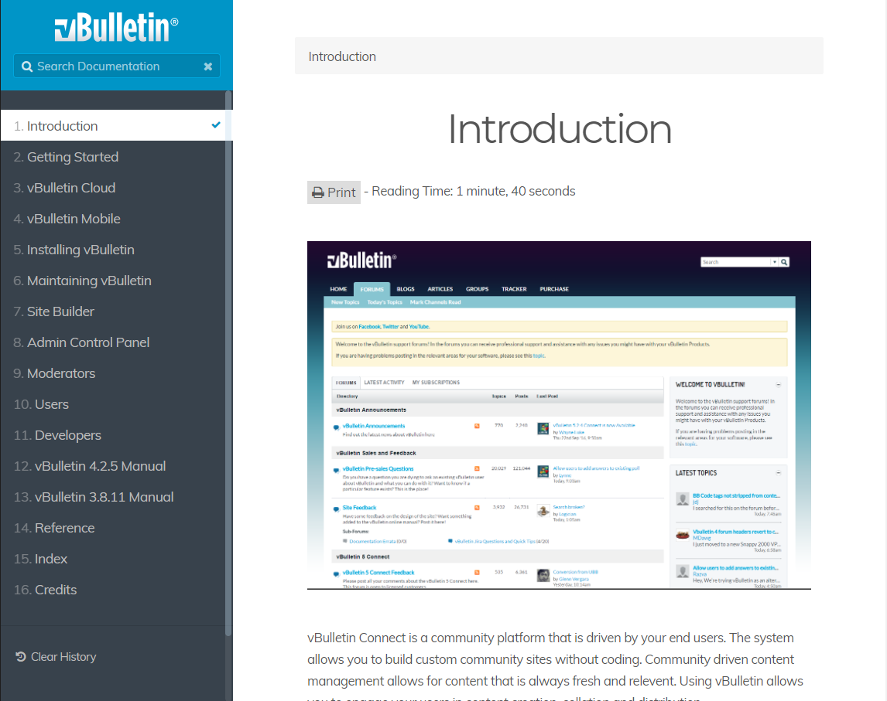

# vB5-Manual

*This document is targeted towards people who want to recreate the vBulletin 5 documentation on their own server. If you only wish to report an spelling issue, grammer issue, missing article, or make a suggestion then please click on the [Issues](https://github.com/wayneluke/vB5-Manual/issues) tab above to do so.*

## About the Project
The vBulletin Documentation project using the [Grav](https://getgrav.com) flat-file CMS. Grav uses a series of markdown files and templates to present its content. Due to this, most pages of the documentation are viewable in this repository. The site can be viewed in its complete form at the [vB5 Support](http://vb5support.com) website.

The current vBulletin Manual was built many years ago and has not been updated with new and necessary functionality. It also has a difficult interface to update manuals. Using the Grav system, we can build documentation with a similar hierarchy but include new modern functionality with ease. The Grav CMS is a flatfile CMS without the need for a database. Grav has its own template and caching systems to allow fast rendering of pages. It is also extendible through plugins. 

### Features Added to the Documentation
- Responsive. Open the documentation in a separate window or mobile device and it will conform to the screen.
- Responsive Images - Images adapt automatically to the screen size.
- Markdown style documentation. This documentation can be downloaded from this project and each page can be read in a text editor if desired.
- Automatic Indexing - Indexes are provided for each book and the entire site. The system automatically updates the index when a new article is added.
- Image Galleries. Image Galleries with Lightbox support can be added to articles making it easier to demonstrate steps.
- Features can be easily designated as vBulletin Cloud friendly.
- Video Embedding - Allows the author to embed videos in their articles with full playback control.
- Github Sync - Makes sure the documentation is up to date and "backed up".

### Features to be Added
- PDF Download of specific Books.

## Documentation Structure
The vB5 Manual is broken up into different Books, Chapters, and Articles. Each Book covers a specific set of functionality within the vBulletin 5 Suite.

## New Installation
1. Start by creating a directory to hold your copy of the documentation project. This must be in a web accessible directory. I use one called /manual/ within the a vbulletin virtual host. So on my server, the path would be %webroot%/vbulletin/manual. I will use this path in all examples below. In my local browser, I access it via the address http://%webroote%/vbulletin/manual. If you do not have a development server configured for your OS, you will need to do so in order to use this package. If you're using Windows, I recommend WAMPServer.
1. Download the [RTFM Site Skeleton](https://github.com/getgrav/grav-skeleton-rtfm-site) for the Grav CMS. 
1. Upzip the skeleton package within the directory you created.
1. Rename user/pages within the Skeleton to /user/pages.bak
1. Download the master version of this project and unzip it.
1. Overwrite the files within the Skeleton.
1. Navigate to the site in your web browser.

> Note: Make sure that your webserver can write to the `%webroot%/vbulletin/manual/cache` and `%webroot%/vbulletinmanual/users/data` directories.

### Common GRAV CLI Commands
Grav comes with command line scripts to manage the maintenance and update of its packages. Some of the common ones for this implementation are:
- Update GRAV: `>php bin/gpm selfupdate`
- Update installed plugins and themes: `>php bin/gpm upgrade`
- Rebuild the precache of the site: `>php bin/plugin precache url /`

If you don't have access to the command line, these commands can be run from within the Admin Panel provided by Grav as well.

### Using the Admin Panel.
The Skeleton used provides and Admin Panel to manage the site. You can access this by going to %webroot%/vbulletin/manual/admin. On the first access, you will be required to create an Administrator user account. Using the Admin Panel is beyond the scope of this project. You can learn more on the [Grav Documentation](https://learn.getgrav.org/admin-panel) site.

## Document Generators
The document generators are a series of command line PHP scripts that will automatically create GRAV pages based on information stored in the vBulletin database. This combines a series of queries to retrieve inline help, augmented documentation stored in the database and templates to build Grav Articles. The goal is to be able to frequently update these pages as needed with new version releases.

See the readme.md in the doc_generators folder for more information.
